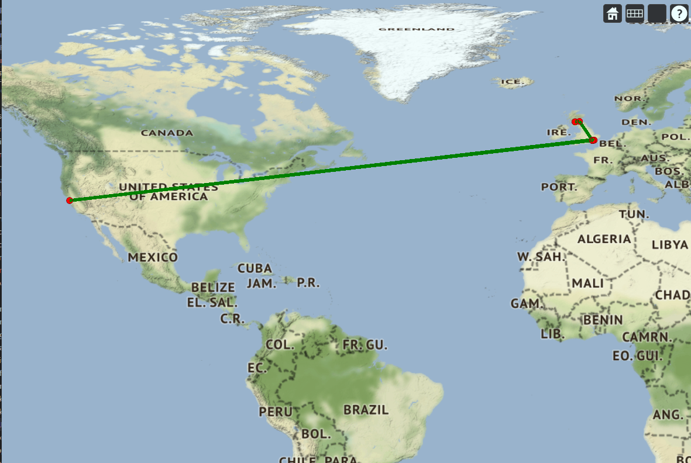

# Thales Mapping Project

---

<div align="center">

</div>
<br/>

<div align="center">

</div>
<br/>

<div align="center">
<a ref="https://stgit.dcs.gla.ac.uk/tp3-2020-CS22/cs22-main-cesium/-/commits/master"></a> &nbsp; 
<a href="https://stgit.dcs.gla.ac.uk/tp3-2020-CS22/cs22-main-cesium/-/commits/master"></a>
&nbsp; 
<a href="https://stgit.dcs.gla.ac.uk/tp3-2020-CS22/cs22-main-cesium/-/commits/master"></a>
</div>
<br/>
<div align="center">

### An application to show and interact with the view frustum of geolocated images or videos on a 3D map.

</div>

## About
CamMap (Name to be decided, this is just what the application is temporarily known as) is an application which allows for the viewing of the view frustum of a video or image with geolocation on a 3D map.  It also maps clicks on the video or image to a real place on the Earth.

## Screenshot
<!---->


## Technologies
##### - Typescript 
##### - Cesium
##### - Karma (for testing)

(All open source)

## Running Instructions
To run, make sure you have node(npm) > 6.0.0 (https://nodejs.org/en/), the most recent one will work well, then open a terminal at the directory and run
```
npm install

npm run start
```
That installs all the required packages and starts a server on [localhost:8080](localhost:8080).  Due to using webpack, this also has hot-reloading.

To build the project, run:
```
npm run build
```
This produces a build which must be served by a server (which serves index.html).

This is the base application which can recieve geolocation connections and use 3D terrain servers.  For a 3D terrain server, see [Cesium Terrain Server](https://stgit.dcs.gla.ac.uk/tp3-2020-CS22/cesium-terrain-server).  For the 3D tilesets to serve, see [Terrain Tilesets](https://stgit.dcs.gla.ac.uk/tp3-2020-CS22/terrain-tile-sets).  For geolocation streaming data, see [Test Geodata Providers](https://stgit.dcs.gla.ac.uk/tp3-2020-CS22/test-geodata-providers).
